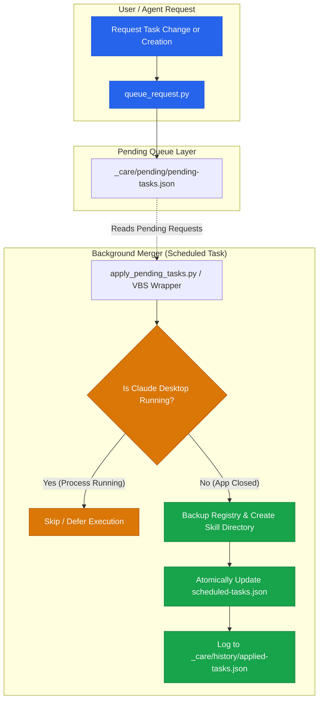

# Automizer for Claude Desktop


[](https://www.python.org/downloads/)
[](pyproject.toml)
[](LICENSE)
[](https://github.com/dev-bricks)
[](https://github.com/open-bricks)
[](tests/)
[](llms.txt)

**Reliably modify, queue, and manage scheduled tasks for the Claude Desktop App — from inside the app, externally via CLI, or when the app is closed.**

Language: **English** | [Deutsch](README_de.md)

> [!NOTE]
> **AI / LLM Agent Ready:** A structured, machine-readable overview for LLM agents is available at [`llms.txt`](llms.txt).

> [!IMPORTANT]
> **Unofficial Community Tool.** This project is an independent community utility and is not affiliated with, endorsed, or audited by Anthropic. "Claude" and "Claude Desktop" are trademarks of Anthropic and are used here solely for descriptive purposes to identify compatible software.
>
> It reads and writes local configuration files created by the Desktop App. Their format is undocumented and subject to unannounced changes across app releases. Backups are automatically created before every write operation. Use at your own risk.

---

## Architecture & Queueing Workflow



---

## The Challenge

The Claude Desktop App manages its scheduled tasks across two separate storage locations:

| Component | Path | Description |
|---|---|---|
| **Task Prompt** | `<Documents>/Claude/Scheduled/<slug>/SKILL.md` | Contains the prompt instructions to execute |
| **Task Registry** | `<AppData>/Claude/local-agent-mode-sessions/<session>/<account>/scheduled-tasks.json` | Stores schedules (`cronExpression`), enabled state, and permissions |

Both components are required for a functional task. Simply creating the prompt folder is insufficient: without a corresponding registry entry and valid `cronExpression`, the task will never trigger and won't appear in the app's schedule overview.

Crucially: **The Desktop App maintains the task registry in memory and writes it back to disk upon session exit.** Any direct modifications made to `scheduled-tasks.json` while the app is active will be silently overwritten and lost without warning.

---

## The Solution

Automizer decouples change requests from disk-write operations through a staged queue:

```
  Queue Request (anytime, in-app or from external agents)
            │
            ▼
    pending-tasks.json ──▶ apply_pending_tasks.py ──▶ Is Claude Desktop Running?
                                                        │
                                        yes ────────────┤  skip and retry next cycle
                                                        │
                                        no ─────────────┴─▶ Backup → Write →
                                                             Verify → Log Report
```

Modifications take effect with a **deliberate delayed execution**. This prevents silent overwrites, avoids race conditions, and provides an auditable history of applied changes.

---

## Three Operating Modes

| Mode | Context | Workflow | Prompt Template |
|---|---|---|---|
| **1. In-App** | LLM running inside Claude Desktop | Append request to `pending-tasks.json` (delayed) | [`prompts/01_in-app_en.md`](prompts/01_in-app_en.md) |
| **2. External (Active)** | External CLI / Agent, app is running | Enqueue request via `queue_request.py` (delayed) | [`prompts/02_from-outside-app-running_en.md`](prompts/02_from-outside-app-running_en.md) |
| **3. App Closed** | App is verified closed | Execute `apply_pending_tasks.py` (immediate) | [`prompts/03_app-closed_en.md`](prompts/03_app-closed_en.md) |

---

## Quickstart & Installation

Prerequisites: **Python 3.8+**. Zero third-party dependencies (standard library only).

```bash
# 1. Verify path detection across local installation
python tools/apply_pending_tasks.py --paths

# 2. Register hourly background merger task (Windows Scheduled Task, no admin needed)
powershell -ExecutionPolicy Bypass -File tools/install_merger_task.ps1

# 3. Acceptance test:
#    a) Trigger while app is open -> changes deferred
#    b) Close app and re-trigger -> changes safely merged
#    c) Zero visible terminal flicker in background mode
```

> [!TIP]
> Always execute the installer via `-File tools/install_merger_task.ps1` rather than pasting snippet contents into PowerShell, ensuring `$PSScriptRoot` resolves reliably.

### Windowless Background Execution

Background execution uses `tools/run_apply_pending_hidden.vbs` wrapping `apply_pending_tasks.py` with `WScript.Shell.Run(cmd, 0, False)` and `subprocess.CREATE_NO_WINDOW` to prevent disruptive console popups.

---

## Tooling Overview

| Script | Purpose |
|---|---|
| [`tools/claude_desktop_paths.py`](tools/claude_desktop_paths.py) | Dynamic path resolution for Documents, registry files, and process detection |
| [`tools/queue_request.py`](tools/queue_request.py) | CLI utility for enqueueing `set` or `create` requests into pending queue |
| [`tools/apply_pending_tasks.py`](tools/apply_pending_tasks.py) | Safe merger engine: verifies app state, backs up registry, merges changes, logs |
| [`tools/install_merger_task.ps1`](tools/install_merger_task.ps1) | PowerShell installer registering scheduled background merger |
| [`tools/run_apply_pending_hidden.vbs`](tools/run_apply_pending_hidden.vbs) | Windowless VBScript launch wrapper |

### Robust Path Resolution

On Windows, the Documents folder may be redirected to OneDrive (Known-Folder-Move). Automizer queries the Windows User Shell Folders registry key (`Personal`) rather than guessing `%USERPROFILE%\Documents`. Session GUIDs in AppData are scanned dynamically to select the latest active session.

---

## Safety Guarantees & Safeguards

1. **Path-Based Process Detection:** Distinguishes the Claude Desktop Windows Store app (`*WindowsApps*`) from the Claude Code CLI (`claude.exe`) to prevent false-positive lockouts.
2. **Field Whitelisting:** Strict schema whitelist (`cronExpression`, `enabled`, `model`, `userSelectedFolders`, `permissionMode`, `disableJitter`).
3. **Self-Protection Guard:** Rejects requests attempting to disable maintenance tasks (prefix customizable via `CDA_SELF_PROTECT_PREFIX`).
4. **Pre-Write Backups & Post-Write Verification:** Automatic snapshot created before every modification, followed by immediate readback verification.
5. **Fail-Closed Cross-Host Isolation:** Pending wishes tagged with foreign host identifiers in multi-device OneDrive setups are preserved rather than consumed locally.
6. **No Silent Drops:** Rejected or malformed wishes are logged with clear diagnostic rationale.

---

## Optional: Self-Administration Skill

This repository provides two independent layers:

1. **The Core Engine** (`tools/`, `prompts/`) — Queueing mechanism and atomic merger for humans and external agents.
2. **The Self-Administration Skill** ([`skill/self-administration-of-scheduled-tasks/SKILL.md`](skill/self-administration-of-scheduled-tasks/SKILL.md)) — An instruction framework enabling Claude Desktop tasks to maintain, monitor, and optimize themselves through five modular supervisory roles.

---

## Terminology

| Term | Definition |
|---|---|
| **Slug** | Short task identifier matching folder name under `Scheduled/<slug>/` and `id` in the task registry |
| **Wish / Request** | A pending mutation record in `pending-tasks.json` awaiting application |
| **Merger** | `apply_pending_tasks.py` engine applying queued requests when the app is inactive |
| **Registry** | The `scheduled-tasks.json` configuration store inside Claude AppData |

---

## Privacy & Local Execution

Automizer operates **100% locally**. It never communicates over external networks, sends zero telemetry, and requires no API keys or credentials.

`pending-tasks.json`, `applied-tasks.json`, and local logs are strictly excluded via `.gitignore` to safeguard system paths and custom prompt instructions.

---

## License

Released under the [MIT License](LICENSE).
