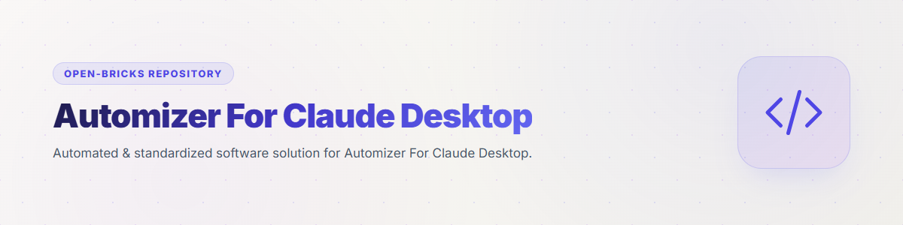
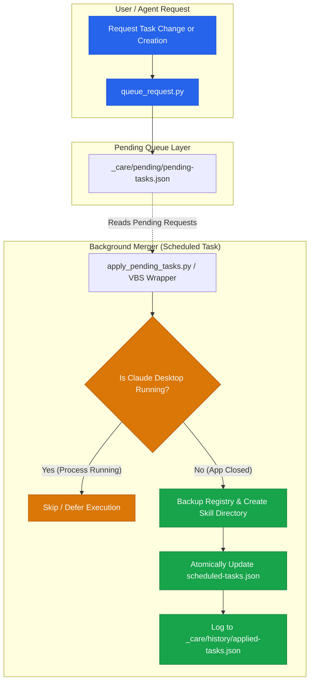

# Automizer for Claude Desktop




[](https://www.python.org/downloads/)
[](LICENSE)
[](https://github.com/dev-bricks)
[](https://github.com/open-bricks)
[](tests/test_automizer.py)
[](llms.txt)

**Geplante Aufgaben der Claude-Desktop-App zuverlässig ändern und anlegen — aus der App heraus, von außen, oder bei geschlossener App.**

[Deutsch](README_de.md) | English

> [!NOTE]
> **Maschinenlesbarer Kontext:** Eine kompakte Projektübersicht für LLM-Agenten ist unter [`llms.txt`](llms.txt) verfügbar.

> [!IMPORTANT]
> **Inoffizielles Werkzeug.** Dieses Projekt ist ein unabhängiges Community-Tool und steht in keiner Verbindung zu Anthropic. Es wird von Anthropic weder herausgegeben noch unterstützt oder geprüft. „Claude" und „Claude Desktop" sind Bezeichnungen von Anthropic und werden hier ausschließlich beschreibend verwendet.
>
> Es liest und schreibt lokale Dateien, die die Desktop-App anlegt. Deren Format ist nicht dokumentiert und kann sich mit jeder Version ändern. Vor jedem Schreiben wird eine Sicherung angelegt. Nutzung auf eigene Verantwortung.

---

## Architecture & Queueing Workflow



---

## Das Problem

Die Desktop-App verwaltet ihre geplanten Aufgaben in zwei getrennten Ablagen:

| Was | Wo |
|---|---|
| **Auftragstext** — was zu tun ist | `<Dokumente>/Claude/Scheduled/<slug>/SKILL.md` |
| **Aufgabenliste** — wann es zu tun ist | `<App-Daten>/Claude/local-agent-mode-sessions/<session>/<account>/scheduled-tasks.json` |

Beides zusammen ergibt erst eine laufende Aufgabe. Nur den Ordner anzulegen genügt nicht:
Ohne Eintrag in der Aufgabenliste — und ohne `cronExpression` darin — läuft die Aufgabe nie und erscheint nicht einmal in der Übersicht der App.

Der eigentliche Stolperstein liegt aber woanders: **Die App hält die Aufgabenliste im Speicher und schreibt sie beim Ende eines Laufs komplett neu.** Wer sie ändert, während die App läuft, verliert seine Änderung wieder — ohne Fehlermeldung. Das trifft Läufe innerhalb der App genauso wie Werkzeuge von außen. Man merkt es erst, wenn die Aufgabe weiterhin zur alten Zeit startet.

## Die Lösung

Wünsche werden vom Schreiben entkoppelt:

```
  Wunsch schreiben (jederzeit, von innen wie von außen)
            │
            ▼
   pending-tasks.json ──▶ apply_pending_tasks.py ──▶ Läuft die App?
                                                       │
                                       ja ─────────────┤  nichts tun, später erneut
                                                       │
                                      nein ────────────┴─▶ Backup → schreiben →
                                                            nachlesen → protokollieren
```

Ein Wunsch wirkt also **verzögert**. Das ist kein Mangel, sondern der Punkt: Er geht nicht verloren, und er wird nachprüfbar angewandt.

---

## Die drei Betriebsarten

| # | Lage | Was möglich ist | Prompt |
|---|---|---|---|
| 1 | LLM läuft **in** der App | Wunsch hinterlegen (verzögert) | [`prompts/01_in-der-app.md`](prompts/01_in-der-app.md) |
| 2 | Zugriff **von außen**, App läuft | Wunsch einreihen per CLI (verzögert) | [`prompts/02_von-aussen-app-laeuft.md`](prompts/02_von-aussen-app-laeuft.md) |
| 3 | App ist **geschlossen** | direkt anwenden (sofort) | [`prompts/03_app-geschlossen.md`](prompts/03_app-geschlossen.md) |

Die Prompt-Dateien sind zum Kopieren gedacht — in den Auftragstext einer Aufgabe (1) oder in den Kontext eines externen Agenten (2, 3).

---

## Installation

Voraussetzung: Python 3.8+. Keine Abhängigkeiten außerhalb der Standardbibliothek.

```bash
# 1. Pfade prüfen — findet das Werkzeug die Ablagen dieser Installation?
python tools/apply_pending_tasks.py --paths

# 2. Merger als stündlichen, fensterlosen Windows-Task registrieren (kein Admin nötig)
powershell -ExecutionPolicy Bypass -File tools/install_merger_task.ps1

# 3. Abnahme
#    a) bei geöffneter App auslösen -> es darf sich nichts ändern
#    b) App schließen, erneut auslösen -> Wunsch wird angewandt
#    c) in beiden Fällen darf kein Fenster aufblitzen
```

Ohne Schritt 2 funktioniert alles weiterhin — die Wünsche werden dann nur nicht von selbst angewandt, sondern erst beim manuellen `python tools/apply_pending_tasks.py`.

Den Installer **per `-File` aufrufen**, nicht den Inhalt in eine Konsole einfügen: Sonst ist `$PSScriptRoot` leer, der Task wird mit leerem Argument registriert und läuft stündlich ins Nichts. Prüfen lässt sich das mit:

```powershell
(Get-ScheduledTask -TaskName "claude-desktop-pending-merger").Actions[0].Arguments
```

### Warum ein VBS-Wrapper

„Fensterlos" heißt hier: versteckte Konsole, nicht gar keine. Ein nacktes `pythonw` genügt nicht, sobald Unterprozesse starten — die allozieren sich sonst eigene, sichtbare Fenster. Der Wrapper startet über `WScript.Shell.Run(cmd, 0, False)`, im Python-Teil sorgt `CREATE_NO_WINDOW` für den Rest.

---

## Werkzeuge

| Datei | Zweck |
|---|---|
| `tools/claude_desktop_paths.py` | Findet Dokumente-Ordner, Aufgabenliste und App-Zustand — ohne zu raten |
| `tools/queue_request.py` | Wunsch einreihen (`set` / `create`), ohne JSON von Hand |
| `tools/apply_pending_tasks.py` | Der Merger: prüft, schreibt, verifiziert, protokolliert |
| `tools/install_merger_task.ps1` | Registriert den stündlichen Windows-Task |
| `tools/run_apply_pending_hidden.vbs` | Fensterloser Start des Mergers |

### Warum Pfade nicht geraten werden

Der Dokumente-Ordner ist **nicht** verlässlich `%USERPROFILE%\Documents`. Wird er nach OneDrive umgeleitet (Known-Folder-Move), zeigt der Shell-Ordner „Personal" woanders hin — ein fest verdrahteter Pfad findet die Aufgaben dann nicht. Deshalb wird er aus der Registry gelesen. Die GUIDs im Pfad der Aufgabenliste wechseln ebenfalls; dort wird gesucht und die zuletzt geschriebene Datei genommen.

---

## Was das Werkzeug bewusst nicht tut

- **Löschen.** Aufgaben zu entfernen bleibt dem Menschen in der App. Ein versehentlich gelöschter Auftragstext ist nicht wiederherstellbar.
- **`filePath` ändern.** Sonst ließe sich ein Eintrag auf eine beliebige fremde Datei umbiegen. Das Feld steht nicht auf der Whitelist.
- **Zeitpläne erfinden.** Wo keiner gesetzt war, wird gemeldet statt geraten.
- **Im Zweifel schreiben.** Lässt sich der App-Zustand nicht ermitteln, gilt „läuft" — lieber ein Lauf ausgelassen als in eine offene App hineingeschrieben.

### Sicherungen

1. **App-Erkennung über den Pfad**, nicht über den Prozessnamen. Auf Windows heißt die Claude-Code-CLI ebenfalls `claude.exe`; ein reiner Namensfilter löst Fehlalarm aus.
2. **Feld-Whitelist:** nur `cronExpression`, `enabled`, `model`, `userSelectedFolders`, `permissionMode`, `disableJitter`.
3. **Selbstschutz:** Ein Wunsch, der eine Pflege-Aufgabe deaktiviert, wird abgelehnt — sonst schaltet sich die Pflege selbst ab. Präfix über `CDA_SELF_PROTECT_PREFIX` einstellbar (leer = aus).
4. **Backup vor jedem Schreiben**, **Nachlesen danach** — Abweichungen werden als WARNUNG protokolliert.
5. **`previousValues`** in der Historie — ohne Vorzustand kein Rollback.
6. **Abgelehnte Wünsche verschwinden nicht still**, sondern mit Grund im Log.

---

## Optional: der Self-Administration-Skill

Dieses Repo liefert zwei Dinge, die unabhängig voneinander nutzbar sind:

**Die Mechanik** (`tools/`, `prompts/`) — Wünsche einreihen und sicher anwenden. Für sich allein nutzbar: Ein Mensch oder ein beliebiger Agent kann damit Aufgaben ändern und anlegen.

**Den Skill** ([`skill/self-administration-of-scheduled-tasks/`](skill/self-administration-of-scheduled-tasks/SKILL.md)) — eine Anleitung für ein LLM, wie es sich einen *selbstpflegenden* Kern geplanter Aufgaben einrichtet: fünf schmale Aufsichtsrollen mit je einer Stellschraube (Bestand, Auftragstexte, Frequenz, Kontingent, Systemabgleich), ein gemeinsames Gedächtnis und fertige Prompttexte. Der Skill setzt die Mechanik voraus; die Mechanik läuft auch ohne ihn.

Wer nur gelegentlich einen Zeitplan ändern will, braucht den Skill nicht. Wer möchte, dass die Automationen sich selbst überwachen, installiert ihn zusätzlich.

---

## Begriffe

| Begriff | Bedeutung |
|---|---|
| **Slug** | Kurzname einer Aufgabe = Ordnername unter `Scheduled\` = `id` in der Aufgabenliste |
| **Wunsch** | Ein Eintrag in `pending-tasks.json`, noch nicht angewandt |
| **Merger** | `apply_pending_tasks.py` — wendet Wünsche an, wenn die App zu ist |
| **Registry** | Hier: die Aufgabenliste `scheduled-tasks.json` (nicht die Windows-Registry) |

## Daten und Datenschutz

Das Werkzeug arbeitet **ausschließlich lokal**. Es sendet nichts über das Netz — weder Telemetrie noch Inhalte — und benötigt keine Zugangsdaten.

Es liest und schreibt drei Dinge auf demselben Rechner: die Aufgabenliste der App, die Auftragstexte unter `Scheduled/` und seine eigenen Dateien unter `_care/`. Diese Dateien können beschreiben, welche Ordner eine Aufgabe lesen darf, und der Auftragstext kann beliebige eigene Inhalte enthalten.

Daraus folgt für den Betrieb: **`pending-tasks.json`, `applied-tasks.json` und Logdateien gehören nicht in ein Repository** — sie enthalten die Pfade und Absichten des jeweiligen Systems. Die mitgelieferte `.gitignore` schließt sie deshalb aus.

## Lizenz und Herkunft

MIT — siehe [LICENSE](LICENSE). Sie erfasst alles in diesem Repository: Code, Prompttexte und Dokumentation.

**Drittbestandteile:** keine. Die Werkzeuge nutzen nur die Python-Standardbibliothek sowie bordeigene Windows-Programme (`wscript`, `powershell`, Aufgabenplanung).

**Entstehung:** Code, Prompts und Dokumentation sind unter Einsatz von LLMs entstanden und anschließend von Hand geprüft und gegen eine echte Installation getestet. Der Ablauf (Wunschkanal statt Direktschreiben) geht auf einen empirischen Befund zurück: Die App setzte eine direkt geschriebene Änderung nach dem nächsten Lauf-Ende zurück.
