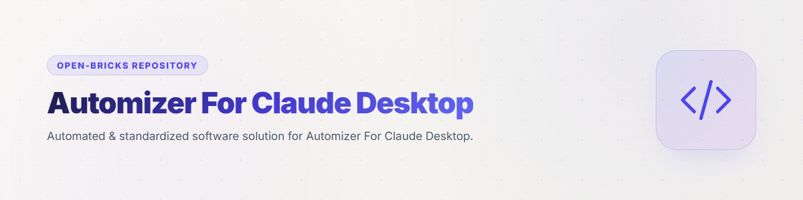
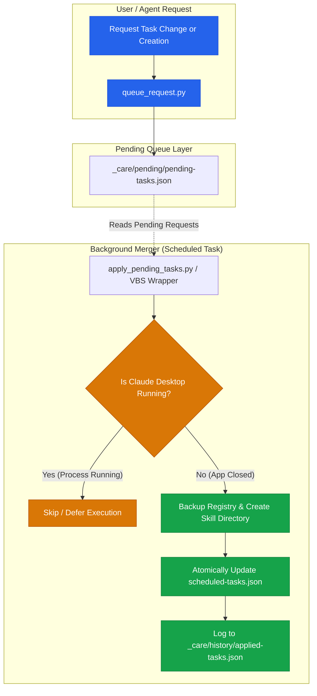
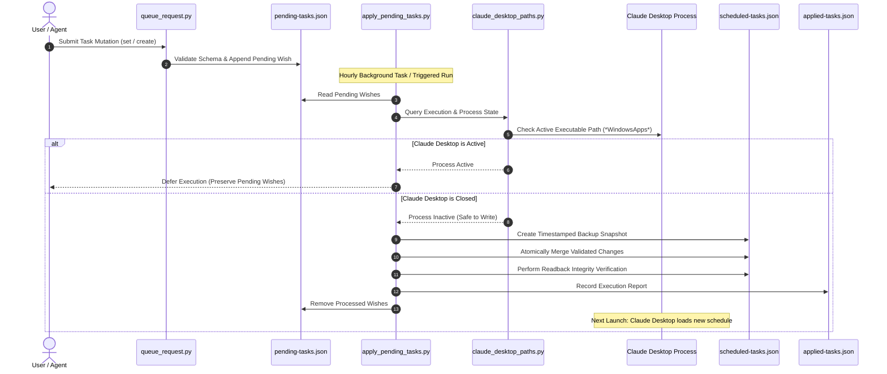

# Automizer for Claude Desktop



[](https://github.com/dev-bricks/automizer-for-claude-desktop/actions/workflows/ci.yml)
[](https://github.com/dev-bricks/automizer-for-claude-desktop)
[](https://www.python.org/downloads/)
[](pyproject.toml)
[](LICENSE)
[](NOTICE)
[](THIRD_PARTY_LICENSES.txt)
[](https://github.com/dev-bricks)
[](https://github.com/open-bricks)
[](SECURITY.md)
[](tests/)
[](llms.txt)
[](CHANGELOG.md)

**Reliably modify, queue, and manage scheduled tasks for the Claude Desktop App — from inside the app, externally via CLI, or when the app is closed.**

Language: **English** | [Deutsch](README_de.md)

> [!NOTE]
> **AI / LLM Agent Ready:** A structured, machine-readable overview for LLM agents is available at [`llms.txt`](llms.txt).

> [!IMPORTANT]
> **Unofficial Community Tool.** This project is an independent community utility and is not affiliated with, endorsed, or audited by Anthropic. "Claude" and "Claude Desktop" are trademarks of Anthropic and are used here solely for descriptive purposes to identify compatible software.
>
> It reads and writes local configuration files created by the Desktop App. Their format is undocumented and subject to unannounced changes across app releases. Backups are automatically created before every write operation. Use at your own risk.

---

<a id="sec-00"></a><a id="quick-navigation"></a><a id="schnellnavigation"></a>
## Quick Navigation

| Sec | Section Title (English) | Abschnitt (Deutsch) | Jump Link |
|---|---|---|---|
| **01** | [Architecture & Queueing Workflow](#sec-01) | [Architektur & Warteschlangen-Workflow](#sec-01) | `#architecture-and-queueing-workflow` |
| **02** | [End-to-End Task Lifecycle](#sec-02) | [End-to-End Aufgaben-Lebenszyklus](#sec-02) | `#end-to-end-task-lifecycle` |
| **03** | [The Challenge](#sec-03) | [Die Herausforderung](#sec-03) | `#the-challenge` |
| **04** | [The Solution](#sec-04) | [Die Lösung](#sec-04) | `#the-solution` |
| **05** | [Key Capabilities & Safety Invariants](#sec-05) | [Hauptmerkmale & Sicherheitsinvarianten](#sec-05) | `#key-capabilities-and-safety-invariants` |
| **06** | [Target Personas & High-Intent SEO Queries](#sec-06) | [Zielgruppen & High-Intent SEO-Suchanfragen](#sec-06) | `#target-personas-and-high-intent-seo-queries` |
| **07** | [Comparative Matrix vs. Alternatives](#sec-07) | [Vergleichsmatrix gegenüber Alternativen](#sec-07) | `#comparative-matrix-vs-alternatives` |
| **08** | [Three Operating Modes](#sec-08) | [Drei Betriebsmodi](#sec-08) | `#three-operating-modes` |
| **09** | [Quickstart & Installation](#sec-09) | [Schnellstart & Installation](#sec-09) | `#quickstart-and-installation` |
| **10** | [Windowless Background Execution](#sec-10) | [Fensterlose Hintergrundausführung](#sec-10) | `#windowless-background-execution` |
| **11** | [Tooling Overview & Path Resolution](#sec-11) | [Werkzeug-Übersicht & Pfadauflösung](#sec-11) | `#tooling-overview-and-path-resolution` |
| **12** | [Safety Guarantees & Safeguards](#sec-12) | [Sicherheitsgarantien & Schutzmechanismen](#sec-12) | `#safety-guarantees-and-safeguards` |
| **13** | [Optional Self-Administration Skill](#sec-13) | [Optionaler Selbstadministrations-Skill](#sec-13) | `#optional-self-administration-skill` |
| **14** | [Terminology](#sec-14) | [Terminologie](#sec-14) | `#terminology` |
| **15** | [Privacy & Local-First Execution](#sec-15) | [Datenschutz & Lokale Ausführung](#sec-15) | `#privacy-and-local-first-execution` |
| **16** | [Sibling Tools & Ecosystem](#sec-16) | [Geschwister-Werkzeuge & Ökosystem](#sec-16) | `#sibling-tools-and-ecosystem` |
| **17** | [Security & Vulnerability Reporting](#sec-17) | [Sicherheit & Schwachstellenmeldung](#sec-17) | `#security-and-vulnerability-reporting` |
| **18** | [License & Statutory Disclaimer (§ 521 BGB)](#sec-18) | [Lizenz & Gesetzlicher Haftungsausschluss (§ 521 BGB)](#sec-18) | `#license-and-statutory-disclaimer` |

---

<a id="sec-01"></a><a id="architecture-and-queueing-workflow"></a><a id="architektur-und-warteschlangen-workflow"></a>
## 01. Architecture & Queueing Workflow

Automizer orchestrates task mutations through a decoupled staging queue. This architecture guarantees that active sessions are never interrupted while eliminating silent disk-write clobbering:


```mermaid
flowchart TD
    subgraph AgentOrUser ["User / Agent Request"]
        A["Request Task Change or Creation"] --> B["queue_request.py"]
    end

    subgraph CareQueue ["Pending Queue Layer"]
        B --> C["_care/pending/pending-tasks.json"]
    end

    subgraph BackgroundMerger ["Background Merger (Scheduled Task)"]
        D["apply_pending_tasks.py / VBS Wrapper"] --> E{"Is Claude Desktop Running?"}
        C -. Reads Pending Requests .-> D
        E -- "Yes (Process Running)" --> F["Skip / Defer Execution"]
        E -- "No (App Closed)" --> G["Backup Registry & Create Skill Directory"]
        G --> H["Atomically Update scheduled-tasks.json"]
        H --> I["Log to _care/history/applied-tasks.json"]
    end

    classDef primary fill:#2563eb,stroke:#1d4ed8,color:#fff
    classDef success fill:#16a34a,stroke:#15803d,color:#fff
    classDef warning fill:#d97706,stroke:#b45309,color:#fff
    class A,B primary
    class G,H,I success
    class E,F warning
```

---

<a id="sec-02"></a><a id="end-to-end-task-lifecycle"></a><a id="end-to-end-aufgaben-lebenszyklus"></a>
## 02. End-to-End Task Lifecycle

The sequence below illustrates the life cycle of a task mutation request from submission through deferred application and readback verification:


```mermaid
sequenceDiagram
    autonumber
    actor Agent as User / Agent
    participant QR as queue_request.py
    participant PQ as pending-tasks.json
    participant Engine as apply_pending_tasks.py
    participant Paths as claude_desktop_paths.py
    participant App as Claude Desktop Process
    participant Reg as scheduled-tasks.json
    participant Hist as applied-tasks.json

    Agent->>QR: Submit Task Mutation (set / create)
    QR->>PQ: Validate Schema & Append Pending Wish
    Note over Engine: Hourly Background Task / Triggered Run
    Engine->>PQ: Read Pending Wishes
    Engine->>Paths: Query Execution & Process State
    Paths->>App: Check Active Executable Path (*WindowsApps*)
    alt Claude Desktop is Active
        Paths-->>Engine: Process Active
        Engine-->>Agent: Defer Execution (Preserve Pending Wishes)
    else Claude Desktop is Closed
        Paths-->>Engine: Process Inactive (Safe to Write)
        Engine->>Reg: Create Timestamped Backup Snapshot
        Engine->>Reg: Atomically Merge Validated Changes
        Engine->>Reg: Perform Readback Integrity Verification
        Engine->>Hist: Record Execution Report
        Engine->>PQ: Remove Processed Wishes
        Note over App: Next Launch: Claude Desktop loads new schedule
    end
```

---

<a id="sec-03"></a><a id="the-challenge"></a><a id="die-herausforderung"></a>
## 03. The Challenge

The Claude Desktop App manages its scheduled tasks across two separate storage locations:

| Component | Path | Description |
|---|---|---|
| **Task Prompt** | `<Documents>/Claude/Scheduled/<slug>/SKILL.md` | Contains the prompt instructions to execute |
| **Task Registry** | `<AppData>/Claude/local-agent-mode-sessions/<session>/<account>/scheduled-tasks.json` | Stores schedules (`cronExpression`), enabled state, and permissions |

Both components are required for a functional task. Simply creating the prompt folder is insufficient: without a corresponding registry entry and valid `cronExpression`, the task will never trigger and won't appear in the app's schedule overview.

Crucially: **The Desktop App maintains the task registry in memory and writes it back to disk upon session exit.** Any direct modifications made to `scheduled-tasks.json` while the app is active will be silently overwritten and lost without warning.

---

<a id="sec-04"></a><a id="the-solution"></a><a id="die-loesung"></a>
## 04. The Solution

Automizer decouples change requests from disk-write operations through a staged queue:

```
  Queue Request (anytime, in-app or from external agents)
            │
            ▼
    pending-tasks.json ──▶ apply_pending_tasks.py ──▶ Is Claude Desktop Running?
                                                        │
                                        yes ────────────┤  skip and retry next cycle
                                                        │
                                        no ─────────────┴─▶ Backup → Write →
                                                             Verify → Log Report
```

Modifications take effect with a **deliberate delayed execution**. This prevents silent overwrites, avoids race conditions, and provides an auditable history of applied changes.

---

<a id="sec-05"></a><a id="key-capabilities-and-safety-invariants"></a><a id="hauptmerkmale-und-sicherheitsinvarianten"></a>
## 05. Key Capabilities & Safety Invariants

| Capability | Technical Mechanism | Security & Reliability Invariant |
|---|---|---|
| **Process Discrimination** | Inspects binary path (`*WindowsApps*`) rather than just process name | Distinguishes Desktop App from Claude Code CLI (`claude.exe`) without false lockouts (`INV-PROC-04`) |
| **Decoupled Staging Queue** | Atomically appends requests to `_care/pending/pending-tasks.json` | Non-blocking write isolation; safe to enqueue mutations from active Claude sessions (`INV-QUEUE-03`) |
| **Automated Pre-Write Snapshots** | Backs up `scheduled-tasks.json` with timestamped snapshot before writing | Zero data loss; automated recovery rollback capability on malformed edits (`INV-BACKUP-05`) |
| **Post-Write Readback Verification** | Re-parses JSON and verifies keys immediately after file writes | Guarantees registry integrity before clearing queued mutation requests (`INV-VERIFY-06`) |
| **Strict Field Whitelisting** | Whitelists allowed schema keys (`cronExpression`, `enabled`, `model`, etc.) | Prevents tampering with internal paths or unvalidated configuration fields (`INV-ACD-04`) |
| **Self-Protection Guard** | Rejects requests disabling tasks matching `CDA_SELF_PROTECT_PREFIX` | Prevents automated agents from accidentally disabling supervisory maintenance tasks (`INV-ACD-04`) |
| **Cross-Host Isolation** | Filters pending requests by matching local hostname | Safe synchronization across multi-device OneDrive environments (`INV-HOST-07`) |
| **Zero-Egress & Standard Library** | 100% Python standard library with zero external dependencies | Completely offline; zero telemetry, zero analytics, zero network exposure (`INV-LOCAL-01`) |
| **Windowless Background Runner** | Windows Script Host VBScript runner with `WScript.Shell.Run(cmd, 0, False)` | No console popups or focus-stealing flickers during background cycles (`INV-WINDOW-08`) |
| **Audit Logging & History** | Structured JSON report in `_care/history/applied-tasks.json` | Fully auditable mutation history with execution timestamp and status (`INV-AUDIT-09`) |

---

<a id="sec-06"></a><a id="target-personas-and-high-intent-seo-queries"></a><a id="zielgruppen-und-high-intent-seo-suchanfragen"></a>
## 06. Target Personas & High-Intent SEO Queries

Automizer for Claude Desktop is purposefully engineered for four distinct technical profiles:

### `[PERSONA-01]` Autonomous AI Agent & Claude Prompt Engineer
- **Profile:** Developers running autonomous agent loops (Claude Code CLI, OpenAI Codex CLI, Google Antigravity, Kimi Code) seeking to schedule periodic maintenance routines inside Claude Desktop.
- **Pain Point:** Modifying `scheduled-tasks.json` from subagent processes while Claude Desktop is running causes immediate memory overwrite on app shutdown.
- **Solution:** Enqueueing requests via `queue_request.py` ensures scheduled routines are staged safely and merged during dormant intervals.
- **High-Intent Search Queries:** `"claude desktop automate scheduled tasks"`, `"claude desktop schedule prompt via cli"`, `"programmatically add scheduled tasks claude desktop"`.

### `[PERSONA-02]` Windows System Administrator & DevOps Engineer
- **Profile:** System engineers managing developer workstations who need reliable, headless automation under Windows without elevated privileges.
- **Pain Point:** Scheduled tasks that trigger CMD or PowerShell windows steal desktop focus, interrupting user keyboard and mouse activity.
- **Solution:** Automizer provides a native windowless VBScript runner (`run_apply_pending_hidden.vbs`) and unprivileged `RunAsInvoker` installation.
- **High-Intent Search Queries:** `"claude desktop windows task scheduler hidden"`, `"run python scheduled task without console popup windows"`, `"claude desktop unattended task merger"`.

### `[PERSONA-03]` Privacy-Conscious Developer & Local-First Builder
- **Profile:** Security professionals and developers working in air-gapped, zero-trust, or enterprise environments where third-party package supply chains are restricted.
- **Pain Point:** Tools requiring heavy third-party wheels or telemetric reporting introduce compliance risk and network egress liabilities.
- **Solution:** 100% Python standard library runtime (`INV-LOCAL-01`), audited Level 1 SBOM, and zero external network sockets.
- **High-Intent Search Queries:** `"claude desktop offline task scheduler"`, `"zero egress claude desktop automation"`, `"air gapped claude task manager python"`.

### `[PERSONA-04]` Multi-Device Workflow Orchestrator
- **Profile:** Power users synchronizing development repositories and documents across multiple machines (e.g. Workstation and Laptop via OneDrive or Syncthing).
- **Pain Point:** Synchronization conflicts and tasks intended for a specific hardware node executing improperly on alternate hosts.
- **Solution:** Hostname-aware fail-closed queueing (`INV-HOST-07`) isolates mutations so only the targeted host applies its designated tasks.
- **High-Intent Search Queries:** `"claude desktop sync scheduled tasks onedrive"`, `"multi host task scheduler claude desktop"`, `"fail closed scheduled tasks multi device"`.

---

<a id="sec-07"></a><a id="comparative-matrix-vs-alternatives"></a><a id="vergleichsmatrix-gegenueber-alternativen"></a>
## 07. Comparative Matrix vs. Alternatives

The table below contrasts Automizer for Claude Desktop against alternative approaches across the 10 canonical invariants:

| Invariant / Dimension | Automizer for Claude Desktop | Native Claude In-App UI | Direct JSON File Edits | Generic Windows Task Scheduler | Background Daemon Loop |
|---|:---:|:---:|:---:|:---:|:---:|
| **INV-LOCAL-01 (100% Zero-Egress Offline)** | **PASS (100% Offline)** | WARN (Cloud Sync) | PASS (Local Disk) | PASS (Local OS) | WARN (Often Uses Network) |
| **INV-UNPRIV-02 (Unprivileged RunAsInvoker)** | **PASS (Standard User)** | PASS (User Mode) | PASS (User Mode) | WARN (Often Needs Admin) | WARN (Service Elevation) |
| **INV-QUEUE-03 (Decoupled Staged Queue)** | **PASS (Atomic Queue)** | FAIL (Manual UI Only) | FAIL (Race Conditions) | FAIL (Direct Trigger) | FAIL (Memory Bloat) |
| **INV-PROC-04 (Process Discrimination)** | **PASS (`*WindowsApps*`)** | FAIL (N/A) | FAIL (Blind Write) | FAIL (No Process Check) | WARN (Process Name Only) |
| **INV-BACKUP-05 (Pre-Write Snapshots)** | **PASS (Timestamped Backup)** | FAIL (No Versioning) | FAIL (Manual Only) | FAIL (No Registry Snap) | FAIL (No Backup) |
| **INV-VERIFY-06 (Post-Write Readback)** | **PASS (JSON Readback)** | FAIL (Opaque Memory) | FAIL (No Readback) | FAIL (Exit Code Only) | FAIL (No Data Check) |
| **INV-HOST-07 (Multi-Host Isolation)** | **PASS (Hostname Filter)** | FAIL (Single Machine) | FAIL (Sync Conflicts) | FAIL (Local Only) | FAIL (No Cloud Sync Guard) |
| **INV-WINDOW-08 (Windowless Background)** | **PASS (Zero Console Flicker)** | FAIL (GUI Foreground) | PASS (CLI Only) | WARN (Console Popups) | WARN (Console or Tray) |
| **INV-AUDIT-09 (Structured Audit Log)** | **PASS (`applied-tasks.json`)** | FAIL (No Log) | FAIL (No Record) | WARN (Windows Event Log) | WARN (Plain Text Log) |
| **INV-SLA-10 (§ 521 BGB & 48h SLA)** | **PASS (Documented SLA)** | WARN (Proprietary SLA) | FAIL (No Policy) | FAIL (No Policy) | FAIL (No Policy) |

---

<a id="sec-08"></a><a id="three-operating-modes"></a><a id="drei-betriebsmodi"></a>
## 08. Three Operating Modes

Automizer adapts seamlessly to three operational environments:

| Mode | Context | Workflow | Prompt Template |
|---|---|---|---|
| **1. In-App** | LLM running inside Claude Desktop | Append request to `pending-tasks.json` (delayed) | [`prompts/01_in-app_en.md`](prompts/01_in-app_en.md) |
| **2. External (Active)** | External CLI / Agent, app is running | Enqueue request via `queue_request.py` (delayed) | [`prompts/02_from-outside-app-running_en.md`](prompts/02_from-outside-app-running_en.md) |
| **3. App Closed** | App is verified closed | Execute `apply_pending_tasks.py` (immediate) | [`prompts/03_app-closed_en.md`](prompts/03_app-closed_en.md) |

---

<a id="sec-09"></a><a id="quickstart-and-installation"></a><a id="schnellstart-und-installation"></a>
## 09. Quickstart & Installation

Prerequisites: **Python 3.8+**. Zero third-party dependencies (standard library only).

```bash
# 1. Verify path detection across local installation
python tools/apply_pending_tasks.py --paths

# 2. Register hourly background merger task (Windows Scheduled Task, no admin needed)
powershell -ExecutionPolicy Bypass -File tools/install_merger_task.ps1

# 3. Acceptance test:
#    a) Trigger while app is open -> changes deferred
#    b) Close app and re-trigger -> changes safely merged
#    c) Zero visible terminal flicker in background mode
```

> [!TIP]
> Always execute the installer via `-File tools/install_merger_task.ps1` rather than pasting snippet contents into PowerShell, ensuring `$PSScriptRoot` resolves reliably.

---

<a id="sec-10"></a><a id="windowless-background-execution"></a><a id="fensterlose-hintergrundausfuehrung"></a>
## 10. Windowless Background Execution

Scheduled maintenance must never steal focus from active work. Standard Windows scheduled tasks executing Python or PowerShell often spawn transient console windows.

Automizer solves this cleanly via [`tools/run_apply_pending_hidden.vbs`](tools/run_apply_pending_hidden.vbs):
- Invokes the Windows Script Host shell with window style `0` (`SW_HIDE`):
  ```vbscript
  WScript.CreateObject("WScript.Shell").Run cmd, 0, False
  ```
- Subprocesses spawned by Python internal checks utilize `subprocess.CREATE_NO_WINDOW` (`0x08000000`).
- The resulting background merge execution is 100% invisible, flicker-free, and non-intrusive.

---

<a id="sec-11"></a><a id="tooling-overview-and-path-resolution"></a><a id="werkzeug-uebersicht-und-pfadaufloesung"></a>
## 11. Tooling Overview & Path Resolution

| Script | Purpose |
|---|---|
| [`tools/claude_desktop_paths.py`](tools/claude_desktop_paths.py) | Dynamic path resolution for Documents, registry files, and process detection |
| [`tools/queue_request.py`](tools/queue_request.py) | CLI utility for enqueueing `set` or `create` requests into pending queue |
| [`tools/apply_pending_tasks.py`](tools/apply_pending_tasks.py) | Safe merger engine: verifies app state, backs up registry, merges changes, logs |
| [`tools/install_merger_task.ps1`](tools/install_merger_task.ps1) | PowerShell installer registering scheduled background merger |
| [`tools/run_apply_pending_hidden.vbs`](tools/run_apply_pending_hidden.vbs) | Windowless VBScript launch wrapper |

### Robust Path Resolution
On Windows, the Documents folder may be redirected to OneDrive (Known-Folder-Move). Automizer queries the Windows User Shell Folders registry key (`Personal`) rather than guessing `%USERPROFILE%\Documents`. Session GUIDs in AppData are scanned dynamically to select the latest active session.

---

<a id="sec-12"></a><a id="safety-guarantees-and-safeguards"></a><a id="sicherheitsgarantien-und-schutzmechanismen"></a>
## 12. Safety Guarantees & Safeguards

1. **Path-Based Process Detection:** Distinguishes the Claude Desktop Windows Store app (`*WindowsApps*`) from the Claude Code CLI (`claude.exe`) to prevent false-positive lockouts.
2. **Field Whitelisting:** Strict schema whitelist (`cronExpression`, `enabled`, `model`, `userSelectedFolders`, `permissionMode`, `disableJitter`).
3. **Self-Protection Guard:** Rejects requests attempting to disable maintenance tasks (prefix customizable via `CDA_SELF_PROTECT_PREFIX`).
4. **Pre-Write Backups & Post-Write Verification:** Automatic snapshot created before every modification, followed by immediate readback verification.
5. **Fail-Closed Cross-Host Isolation:** Pending wishes tagged with foreign host identifiers in multi-device OneDrive setups are preserved rather than consumed locally.
6. **No Silent Drops:** Rejected or malformed wishes are logged with clear diagnostic rationale.

---

<a id="sec-13"></a><a id="optional-self-administration-skill"></a><a id="optionaler-selbstadministrations-skill"></a>
## 13. Optional Self-Administration Skill

This repository provides two independent layers:

1. **The Core Engine** (`tools/`, `prompts/`) — Queueing mechanism and atomic merger for humans and external agents.
2. **The Self-Administration Skill** ([`skill/self-administration-of-scheduled-tasks/SKILL.md`](skill/self-administration-of-scheduled-tasks/SKILL.md)) — An instruction framework enabling Claude Desktop tasks to maintain, monitor, and optimize themselves through five modular supervisory roles.

---

<a id="sec-14"></a><a id="terminology"></a><a id="terminologie"></a>
## 14. Terminology

| Term | Definition |
|---|---|
| **Slug** | Short task identifier matching folder name under `Scheduled/<slug>/` and `id` in the task registry |
| **Wish / Request** | A pending mutation record in `pending-tasks.json` awaiting application |
| **Merger** | `apply_pending_tasks.py` engine applying queued requests when the app is inactive |
| **Registry** | The `scheduled-tasks.json` configuration store inside Claude AppData |
| **Session GUID** | Dynamic session identifier folder located below `local-agent-mode-sessions/` |

---

<a id="sec-15"></a><a id="privacy-and-local-first-execution"></a><a id="datenschutz-und-lokale-ausfuehrung"></a>
## 15. Privacy & Local-First Execution

Automizer operates **100% locally**. It never communicates over external networks, sends zero telemetry, and requires no API keys or credentials.

`pending-tasks.json`, `applied-tasks.json`, and local logs are strictly excluded via `.gitignore` to safeguard system paths and custom prompt instructions.

---

<a id="sec-16"></a><a id="sibling-tools-and-ecosystem"></a><a id="geschwister-werkzeuge-und-oekosystem"></a>
## 16. Sibling Tools & Ecosystem

`automizer-for-claude-desktop` is part of the [`dev-bricks`](https://github.com/dev-bricks) suite under the [`open-bricks`](https://github.com/open-bricks) umbrella:

| Tool | Organization | Focus & Description |
|---|---|---|
| [`safe-start-for-codex`](https://github.com/dev-bricks/safe-start-for-codex) | `dev-bricks` | Safety supervisor & execution guard for autonomous coding agents |
| [`companion-for-agy`](https://github.com/dev-bricks/companion-for-agy) | `dev-bricks` | CLI companion and session coordinator for Antigravity agents |
| [`DevCenter`](https://github.com/dev-bricks/DevCenter) | `dev-bricks` | Central developer workbench and workspace orchestration dashboard |
| [`CodeBox`](https://github.com/dev-bricks/CodeBox) | `dev-bricks` | Local-first code snippet and development asset container |
| [`automation-master`](https://github.com/dev-bricks/automation-master) | `dev-bricks` | Unified multi-agent workflow scheduling and orchestration engine |
| [`MethodenAnalyser`](https://github.com/dev-bricks/MethodenAnalyser) | `dev-bricks` | Structural code analysis and method extraction utility |
| [`coma`](https://github.com/ellmos-ai/coma) | `ellmos-ai` | Cooperative Multi-Agent coordination and lock-free execution protocol |
| [`workflowhooker`](https://github.com/ellmos-ai/workflowhooker) | `ellmos-ai` | Deterministic hook interception and event lifecycle engine |
| [`memoryhooker`](https://github.com/ellmos-ai/memoryhooker) | `ellmos-ai` | Local-first episodic and semantic memory indexing for agents |
| [`open-bricks`](https://github.com/open-bricks) | `open-bricks` | Umbrella organization and open standard specifications |

---

<a id="sec-17"></a><a id="security-and-vulnerability-reporting"></a><a id="sicherheit-und-schwachstellenmeldung"></a>
## 17. Security & Vulnerability Reporting

Please review our [Security Policy](SECURITY.md) for details on responsible vulnerability disclosure and our zero-egress commitments.

- **Security Advisories:** [GitHub Security Advisories](https://github.com/dev-bricks/automizer-for-claude-desktop/security/advisories)
- **Security Contacts:** [security@ellmos.ai](mailto:security@ellmos.ai) · [lukas@open-bricks.org](mailto:lukas@open-bricks.org) · [support@lukasgeiger.com](mailto:support@lukasgeiger.com)
- **Vulnerability Response SLA:** 48-hour initial response acknowledgement; 5 business days triage target.

---

<a id="sec-18"></a><a id="license-and-statutory-disclaimer"></a><a id="lizenz-und-gesetzlicher-haftungsausschluss"></a>
## 18. License & Statutory Disclaimer (§ 521 BGB)

Released under the [MIT License](LICENSE).
Author & Maintainer: **Lukas Geiger** (dev-bricks / open-bricks).
Attribution and third-party notices: [`NOTICE`](NOTICE), [`THIRD_PARTY_LICENSES.md`](THIRD_PARTY_LICENSES.md), and [`THIRD_PARTY_LICENSES.txt`](THIRD_PARTY_LICENSES.txt).

### Statutory Disclaimer under German Law (§ 521 BGB Gefälligkeitsrecht)
This software is provided free of charge as an open-source community utility under the legal framework of German gratuitous service law (§ 521 BGB - Gefälligkeitsrecht). The author and contributors are liable only in cases of intentional misconduct (*Vorsatz*) or gross negligence (*grobe Fahrlässigkeit*). The user assumes sole responsibility for verifying compatibility, configuring task schedules, and backing up local configuration registries before deployment.
