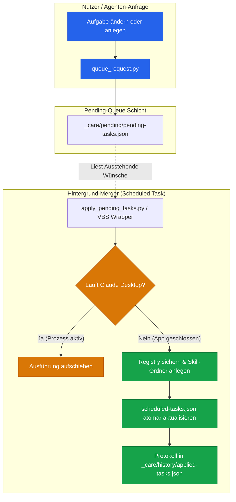

# Automizer for Claude Desktop (Deutsch)

[](https://www.python.org/downloads/)
[](LICENSE)
[](https://github.com/dev-bricks)
[](https://github.com/open-bricks)
[](tests/test_automizer.py)
[](llms.txt)

**Geplante Aufgaben der Claude-Desktop-App zuverlässig ändern und anlegen — aus der App heraus, von außen, oder bei geschlossener App.**

[English](README.md) | Deutsch

> [!NOTE]
> **Maschinenlesbarer Kontext:** Eine kompakte Projektübersicht für LLM-Agenten ist unter [`llms.txt`](llms.txt) verfügbar.

> [!IMPORTANT]
> **Inoffizielles Werkzeug.** Dieses Projekt ist ein unabhängiges Community-Tool und steht in keiner Verbindung zu Anthropic. Es wird von Anthropic weder herausgegeben noch unterstützt oder geprüft.

---

## Architekturdialgramm & Ablauf



---

## Schnellstart

```bash
# Pfade verifizieren
python tools/apply_pending_tasks.py --paths

# Pytest Testsuite ausführen
pytest
```
