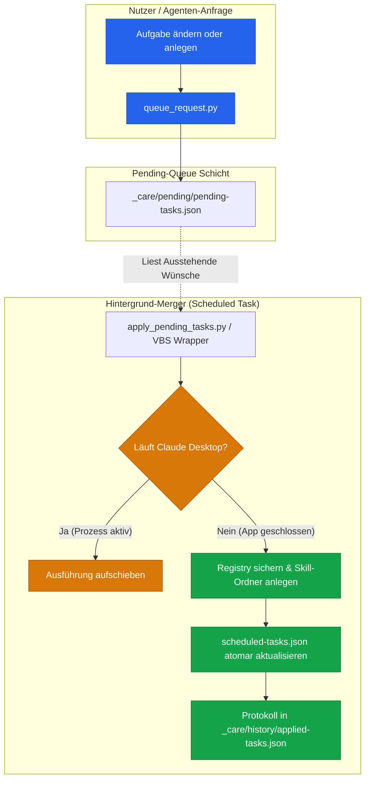
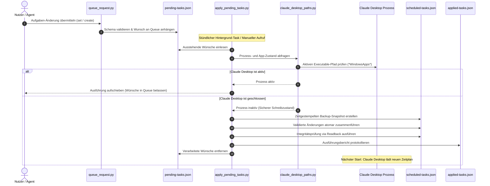

# Automizer for Claude Desktop (Deutsch)


[](https://github.com/dev-bricks/automizer-for-claude-desktop/actions/workflows/ci.yml)
[](https://github.com/dev-bricks/automizer-for-claude-desktop)
[](https://www.python.org/downloads/)
[](pyproject.toml)
[](LICENSE)
[](NOTICE)
[](THIRD_PARTY_LICENSES.txt)
[](https://github.com/dev-bricks)
[](https://github.com/open-bricks)
[](SECURITY.md)
[](tests/)
[](llms.txt)
[](CHANGELOG.md)

**Geplante Aufgaben der Claude-Desktop-App zuverlässig ändern und anlegen — aus der App heraus, von außen via CLI oder bei geschlossener App.**

Sprache: [English](README.md) | **Deutsch**

> [!NOTE]
> **Maschinenlesbarer Kontext:** Eine kompakte Projektübersicht für LLM-Agenten ist unter [`llms.txt`](llms.txt) verfügbar.

> [!IMPORTANT]
> **Inoffizielles Community-Werkzeug.** Dieses Projekt ist ein unabhängiges Community-Tool und steht in keiner Verbindung zu Anthropic. Es wird von Anthropic weder herausgegeben noch unterstützt oder geprüft. „Claude" und „Claude Desktop" sind Bezeichnungen von Anthropic und werden hier ausschließlich beschreibend verwendet.
>
> Es liest und schreibt lokale Dateien, die die Desktop-App anlegt. Deren Format ist nicht dokumentiert und kann sich mit jeder Version ändern. Vor jedem Schreiben wird eine Sicherung angelegt. Nutzung auf eigene Verantwortung.

---

<a id="sec-00"></a><a id="quick-navigation"></a><a id="schnellnavigation"></a>
## Schnellnavigation

| Nr. | Abschnitt (Deutsch) | Section Title (English) | Sprungmarke |
|---|---|---|---|
| **01** | [Architektur & Warteschlangen-Workflow](#sec-01) | [Architecture & Queueing Workflow](#sec-01) | `#architektur-und-warteschlangen-workflow` |
| **02** | [End-to-End Aufgaben-Lebenszyklus](#sec-02) | [End-to-End Task Lifecycle](#sec-02) | `#end-to-end-aufgaben-lebenszyklus` |
| **03** | [Die Herausforderung](#sec-03) | [The Challenge](#sec-03) | `#die-herausforderung` |
| **04** | [Die Lösung](#sec-04) | [The Solution](#sec-04) | `#die-loesung` |
| **05** | [Hauptmerkmale & Sicherheitsinvarianten](#sec-05) | [Key Capabilities & Safety Invariants](#sec-05) | `#hauptmerkmale-und-sicherheitsinvarianten` |
| **06** | [Zielgruppen & High-Intent SEO-Suchanfragen](#sec-06) | [Target Personas & High-Intent SEO Queries](#sec-06) | `#zielgruppen-und-high-intent-seo-suchanfragen` |
| **07** | [Vergleichsmatrix gegenüber Alternativen](#sec-07) | [Comparative Matrix vs. Alternatives](#sec-07) | `#vergleichsmatrix-gegenueber-alternativen` |
| **08** | [Drei Betriebsmodi](#sec-08) | [Three Operating Modes](#sec-08) | `#drei-betriebsmodi` |
| **09** | [Schnellstart & Installation](#sec-09) | [Quickstart & Installation](#sec-09) | `#schnellstart-und-installation` |
| **10** | [Fensterlose Hintergrundausführung](#sec-10) | [Windowless Background Execution](#sec-10) | `#fensterlose-hintergrundausfuehrung` |
| **11** | [Werkzeug-Übersicht & Pfadauflösung](#sec-11) | [Tooling Overview & Path Resolution](#sec-11) | `#werkzeug-uebersicht-und-pfadaufloesung` |
| **12** | [Sicherheitsgarantien & Schutzmechanismen](#sec-12) | [Safety Guarantees & Safeguards](#sec-12) | `#sicherheitsgarantien-und-schutzmechanismen` |
| **13** | [Optionaler Selbstadministrations-Skill](#sec-13) | [Optional Self-Administration Skill](#sec-13) | `#optionaler-selbstadministrations-skill` |
| **14** | [Terminologie](#sec-14) | [Terminology](#sec-14) | `#terminologie` |
| **15** | [Datenschutz & Lokale Ausführung](#sec-15) | [Privacy & Local-First Execution](#sec-15) | `#datenschutz-und-lokale-ausfuehrung` |
| **16** | [Geschwister-Werkzeuge & Ökosystem](#sec-16) | [Sibling Tools & Ecosystem](#sec-16) | `#geschwister-werkzeuge-und-oekosystem` |
| **17** | [Sicherheit & Schwachstellenmeldung](#sec-17) | [Security & Vulnerability Reporting](#sec-17) | `#sicherheit-und-schwachstellenmeldung` |
| **18** | [Lizenz & Gesetzlicher Haftungsausschluss (§ 521 BGB)](#sec-18) | [License & Statutory Disclaimer (§ 521 BGB)](#sec-18) | `#lizenz-und-gesetzlicher-haftungsausschluss` |

---

<a id="sec-01"></a><a id="architecture-and-queueing-workflow"></a><a id="architektur-und-warteschlangen-workflow"></a>
## 01. Architektur & Warteschlangen-Workflow

Automizer entkoppelt Änderungswünsche von Festplatten-Schreibvorgängen über eine gestufte Warteschlange. Dadurch werden aktive Claude-Sitzungen niemals unterbrochen und Race Conditions sowie Datenverlust vollständig verhindert:


```mermaid
flowchart TD
    subgraph AgentOrUser ["Nutzer / Agenten-Anfrage"]
        A["Aufgabe ändern oder anlegen"] --> B["queue_request.py"]
    end

    subgraph CareQueue ["Pending-Queue Schicht"]
        B --> C["_care/pending/pending-tasks.json"]
    end

    subgraph BackgroundMerger ["Hintergrund-Merger (Scheduled Task)"]
        D["apply_pending_tasks.py / VBS Wrapper"] --> E{"Läuft Claude Desktop?"}
        C -. Liest Ausstehende Wünsche .-> D
        E -- "Ja (Prozess aktiv)" --> F["Ausführung aufschieben"]
        E -- "Nein (App geschlossen)" --> G["Registry sichern & Skill-Ordner anlegen"]
        G --> H["scheduled-tasks.json atomar aktualisieren"]
        H --> I["Protokoll in _care/history/applied-tasks.json"]
    end

    classDef primary fill:#2563eb,stroke:#1d4ed8,color:#fff
    classDef success fill:#16a34a,stroke:#15803d,color:#fff
    classDef warning fill:#d97706,stroke:#b45309,color:#fff
    class A,B primary
    class G,H,I success
    class E,F warning
```

---

<a id="sec-02"></a><a id="end-to-end-task-lifecycle"></a><a id="end-to-end-aufgaben-lebenszyklus"></a>
## 02. End-to-End Aufgaben-Lebenszyklus

Das folgende Sequenzdiagramm veranschaulicht den vollständigen Ablauf eines Änderungswunschs von der Registrierung über die zeitverzögerte Zusammenführung bis zur Verifikation:


```mermaid
sequenceDiagram
    autonumber
    actor Agent as Nutzer / Agent
    participant QR as queue_request.py
    participant PQ as pending-tasks.json
    participant Engine as apply_pending_tasks.py
    participant Paths as claude_desktop_paths.py
    participant App as Claude Desktop Prozess
    participant Reg as scheduled-tasks.json
    participant Hist as applied-tasks.json

    Agent->>QR: Aufgaben-Änderung übermitteln (set / create)
    QR->>PQ: Schema validieren & Wunsch an Queue anhängen
    Note over Engine: Stündlicher Hintergrund-Task / Manueller Aufruf
    Engine->>PQ: Ausstehende Wünsche einlesen
    Engine->>Paths: Prozess- und App-Zustand abfragen
    Paths->>App: Aktiven Executable-Pfad prüfen (*WindowsApps*)
    alt Claude Desktop ist aktiv
        Paths-->>Engine: Prozess aktiv
        Engine-->>Agent: Ausführung aufschieben (Wünsche in Queue belassen)
    else Claude Desktop ist geschlossen
        Paths-->>Engine: Prozess inaktiv (Sicherer Schreibzustand)
        Engine->>Reg: Zeitgestempelten Backup-Snapshot erstellen
        Engine->>Reg: Validierte Änderungen atomar zusammenführen
        Engine->>Reg: Integritätsprüfung via Readback ausführen
        Engine->>Hist: Ausführungsbericht protokollieren
        Engine->>PQ: Verarbeitete Wünsche entfernen
        Note over App: Nächster Start: Claude Desktop lädt neuen Zeitplan
    end
```

---

<a id="sec-03"></a><a id="the-challenge"></a><a id="die-herausforderung"></a>
## 03. Die Herausforderung

Die Claude-Desktop-App speichert geplante Aufgaben getrennt an zwei verschiedenen Orten:

| Komponente | Pfad | Beschreibung |
|---|---|---|
| **Aufgaben-Prompt** | `<Documents>/Claude/Scheduled/<slug>/SKILL.md` | Enthält die auszuführenden Prompt-Anweisungen |
| **Aufgaben-Registry** | `<AppData>/Claude/local-agent-mode-sessions/<session>/<account>/scheduled-tasks.json` | Speichert Ausführungszeiten (`cronExpression`), Status und Berechtigungen |

Beide Komponenten sind für eine funktionierende Aufgabe zwingend erforderlich. Ein Prompt-Ordner allein reicht nicht aus: Ohne den Eintrag in `scheduled-tasks.json` mit gültiger `cronExpression` wird die Aufgabe niemals ausgeführt und taucht nicht in der Oberfläche auf.

Das entscheidende Problem: **Die Desktop-App hält die Registry während der Laufzeit im Arbeitsspeicher und überschreibt die Datei beim Beenden blind.** Direkte Änderungen an `scheduled-tasks.json` bei laufender App gehen daher unwiderruflich verloren.

---

<a id="sec-04"></a><a id="the-solution"></a><a id="die-loesung"></a>
## 04. Die Lösung

Automizer entkoppelt das Anfordern von Änderungen vom tatsächlichen Schreiben auf die Festplatte:

```
  Wunsch einstellen (jederzeit möglich, auch während Claude läuft)
            │
            ▼
    pending-tasks.json ──▶ apply_pending_tasks.py ──▶ Läuft Claude Desktop gerade?
                                                        │
                                         ja ────────────┤  überspringen, nächstes Mal
                                                        │
                                         nein ──────────┴─▶ Backup → Schreiben →
                                                             Prüfen → Protokoll
```

Änderungen greifen mit **gewollter Verzögerung** — erst wenn die App geschlossen ist. Dadurch werden Überschreibungen und Race Conditions zuverlässig vermieden.

---

<a id="sec-05"></a><a id="key-capabilities-and-safety-invariants"></a><a id="hauptmerkmale-und-sicherheitsinvarianten"></a>
## 05. Hauptmerkmale & Sicherheitsinvarianten

| Fähigkeit | Technischer Mechanismus | Sicherheits- & Zuverlässigkeits-Invariante |
|---|---|---|
| **Prozess-Unterscheidung** | Prüft den Pfad der Binärdatei (`*WindowsApps*`) statt nur den Namen | Unterscheidet Desktop-App zuverlässig von der Claude Code CLI (`claude.exe`) (`INV-PROC-04`) |
| **Entkoppelte Warteschlange** | Hängt Anforderungen atomar an `_care/pending/pending-tasks.json` an | Schützt vor Schreibkollisionen während laufender Claude-Sitzungen (`INV-QUEUE-03`) |
| **Automatische Sicherungen** | Erstellt vor jedem Schreibvorgang einen zeitgestempelten Snapshot | Kein Datenverlust; Rollback bei fehlerhaften Änderungen möglich (`INV-BACKUP-05`) |
| **Readback-Verifikation** | Liest und validiert geschriebene JSON-Dateien sofort nach dem Schreiben | Garantiert syntaktische Integrität vor Löschung verarbeiteter Wünsche (`INV-VERIFY-06`) |
| **Strikte Feld-Whitelist** | Lässt nur definierte Schema-Felder zu (`cronExpression`, `enabled`, `model` etc.) | Verhindert Manipulation interner Pfade oder unvalidierter Konfigurationswerte (`INV-ACD-04`) |
| **Selbstschutz-Mechanismus** | Blockiert Deaktivierung von Aufgaben mit Prefix `CDA_SELF_PROTECT_PREFIX` | Verhindert, dass Agenten versehentlich eigene Überwachungsroutinen abschalten (`INV-ACD-04`) |
| **Host-Isolation** | Filtert Anforderungen nach Hostname des ausführenden Rechners | Sichere Synchronisation bei Multi-Device-Nutzung über OneDrive (`INV-HOST-07`) |
| **Zero-Egress & Standardbibliothek** | 100% Python-Standardbibliothek ohne externe Abhängigkeiten | Vollständig offline; keine Telemetrie, kein Phoning Home (`INV-LOCAL-01`) |
| **Fensterloser Hintergrund-Runner** | VBScript-Wrapper via `WScript.Shell.Run(cmd, 0, False)` | Keine störenden Konsolenfenster oder Fokus-Verluste bei Hintergrundläufen (`INV-WINDOW-08`) |
| **Strukturiertes Audit-Protokoll** | JSON-Verlauf in `_care/history/applied-tasks.json` | Lückenloser Nachweis über angewendete Änderungen mit Zeitstempel und Begründung (`INV-AUDIT-09`) |

---

<a id="sec-06"></a><a id="target-personas-and-high-intent-seo-queries"></a><a id="zielgruppen-und-high-intent-seo-suchanfragen"></a>
## 06. Zielgruppen & High-Intent SEO-Suchanfragen

Automizer for Claude Desktop richtet sich gezielt an vier anspruchsvolle Entwickler- und Betreiber-Profile:

### `[PERSONA-01]` Autonomer KI-Agent & Claude Prompt Engineer
- **Profil:** Entwickler und Automatisierer (Claude Code CLI, OpenAI Codex CLI, Google Antigravity, Kimi Code), die periodische Aufgaben automatisiert in Claude Desktop einpflegen wollen.
- **Problem:** Direkte Modifikationen an `scheduled-tasks.json` werden beim Schließen der Desktop-App kommentarlos aus dem RAM überschrieben.
- **Lösung:** Das Einstellen von Wünschen über `queue_request.py` puffert Aufgaben sicher und führt sie im Ruhezustand der App atomar zusammen.
- **High-Intent Suchanfragen:** `"claude desktop geplante aufgaben automatisieren"`, `"claude desktop schedule prompt cli"`, `"aufgaben automatisiert in claude desktop eintragen"`.

### `[PERSONA-02]` Windows System-Administrator & DevOps Engineer
- **Profil:** Systembetreuer auf Windows-Entwickler-Workstations, die zuverlässige Hintergrund-Automatisierungen ohne Administrator-Rechte benötigen.
- **Problem:** Scheduled Tasks mit PowerShell oder CMD erzeugen störende, kurz aufblinkende Konsolenfenster, die den Tastaturfokus des Nutzers unterbrechen.
- **Lösung:** Fensterloser VBScript-Runner (`run_apply_pending_hidden.vbs`) und unprivilegierte Installation unter Standard-Benutzerrechten (`RunAsInvoker`).
- **High-Intent Suchanfragen:** `"claude desktop aufgabenplanung ohne fenster"`, `"python scheduled task unsichtbar ausfuehren windows"`, `"claude desktop unattended task merger"`.

### `[PERSONA-03]` Datenschutz-Fokussierter Entwickler & Local-First Builder
- **Profil:** Sicherheitsbeauftragte und Programmierer in Air-Gapped-, Zero-Trust- oder regulierten Umgebungen ohne Fremdpaket-Berechtigungen.
- **Problem:** Externe Wheel-Abhängigkeiten oder Telemetrie-Schnittstellen stellen unkalkulierbare Compliance- und Sicherheitsrisiken dar.
- **Lösung:** Ausnahmslose Ausführung über die Python-Standardbibliothek (`INV-LOCAL-01`), auditiertes Level 1 SBOM und striktes Zero-Egress-Prinzip.
- **High-Intent Suchanfragen:** `"claude desktop offline zeitplaner"`, `"zero egress claude desktop automation"`, `"air gapped claude task manager python"`.

### `[PERSONA-04]` Multi-Device Workflow-Orchestrator
- **Profil:** Entwickler, die Konfigurationen und Dokumente über mehrere Geräte synchronisieren (z. B. Workstation und Laptop via OneDrive oder Syncthing).
- **Problem:** Synchronisationskonflikte und versehentliches Ausführen maschinenspezifischer Aufgaben auf dem falschen Rechner.
- **Lösung:** Hostname-gebundenes Fail-Closed-Routing (`INV-HOST-07`) stellt sicher, dass jeder Rechner nur die für ihn bestimmten Aufgaben verarbeitet.
- **High-Intent Suchanfragen:** `"claude desktop geplante aufgaben synchronisieren onedrive"`, `"multi host task scheduler claude desktop"`, `"fail closed geplante aufgaben mehrere geraete"`.

---

<a id="sec-07"></a><a id="comparative-matrix-vs-alternatives"></a><a id="vergleichsmatrix-gegenueber-alternativen"></a>
## 07. Vergleichsmatrix gegenüber Alternativen

Die folgende Matrix vergleicht Automizer for Claude Desktop mit alternativen Ansätzen entlang der 10 kanonischen Invarianten:

| Invariante / Dimension | Automizer for Claude Desktop | Native Claude In-App Oberfläche | Direkte JSON-Dateibearbeitung | Windows-Aufgabenplanung allein | Hintergrund-Daemon / Endlosschleife |
|---|:---:|:---:|:---:|:---:|:---:|
| **INV-LOCAL-01 (100% Zero-Egress Offline)** | **PASS (100% Offline)** | WARN (Cloud-Sync) | PASS (Lokale Festplatte) | PASS (Lokales Betriebssystem) | WARN (Oft Netzzugriff) |
| **INV-UNPRIV-02 (Unprivilegiertes RunAsInvoker)** | **PASS (Standard-Benutzer)** | PASS (User-Mode) | PASS (User-Mode) | WARN (Oft Admin erforderlich) | WARN (Dienst-Privilegien) |
| **INV-QUEUE-03 (Entkoppelte Staging-Queue)** | **PASS (Atomare Queue)** | FAIL (Nur manuell) | FAIL (Schreibkollisionen) | FAIL (Direktaufruf) | FAIL (Speicher-Overhead) |
| **INV-PROC-04 (Prozess-Diskriminierung)** | **PASS (`*WindowsApps*`)** | FAIL (Nicht anwendbar) | FAIL (Blindes Schreiben) | FAIL (Keine Prozessprüfung) | WARN (Nur nach Name) |
| **INV-BACKUP-05 (Pre-Write Snapshots)** | **PASS (Backup vor Schreiben)** | FAIL (Keine Versionierung) | FAIL (Nur manuell) | FAIL (Keine Registry-Sicherung)| FAIL (Kein Backup) |
| **INV-VERIFY-06 (Post-Write Readback)** | **PASS (JSON-Readback)** | FAIL (Undurchsichtiger RAM)| FAIL (Kein Readback) | FAIL (Nur Exit-Code) | FAIL (Keine Datenprüfung) |
| **INV-HOST-07 (Multi-Host Isolation)** | **PASS (Hostname-Filter)** | FAIL (Einzelrechner) | FAIL (Sync-Konflikte) | FAIL (Nur lokal) | FAIL (Kein Sync-Schutz) |
| **INV-WINDOW-08 (Fensterloser Hintergrund)** | **PASS (Zero-Flicker VBS)** | FAIL (Vordergrund-GUI) | PASS (Nur CLI) | WARN (Konsolen-Aufpoppen) | WARN (Konsole oder Tray) |
| **INV-AUDIT-09 (Strukturiertes Audit-Log)** | **PASS (`applied-tasks.json`)** | FAIL (Kein Protokoll) | FAIL (Kein Nachweis) | WARN (Windows Event-Log) | WARN (Unstrukturiertes Log) |
| **INV-SLA-10 (§ 521 BGB & 48h SLA)** | **PASS (Verbindliche SLA)** | WARN (Proprietäre AGB) | FAIL (Keine Richtlinie) | FAIL (Keine Richtlinie) | FAIL (Keine Richtlinie) |

---

<a id="sec-08"></a><a id="three-operating-modes"></a><a id="drei-betriebsmodi"></a>
## 08. Drei Betriebsmodi

Automizer passt sich flexibel an drei verschiedene Einsatzszenarien an:

| Modus | Kontext | Ablauf | Prompt-Vorlage |
|---|---|---|---|
| **1. In-App** | LLM läuft innerhalb von Claude Desktop | Wunsch an `pending-tasks.json` anhängen (verzögert) | [`prompts/01_in-app_de.md`](prompts/01_in-app_de.md) |
| **2. Von außen (aktiv)** | Externes CLI / Agent, Claude Desktop läuft | Wunsch via `queue_request.py` einstellen (verzögert) | [`prompts/02_from-outside-app-running_de.md`](prompts/02_from-outside-app-running_de.md) |
| **3. App geschlossen** | Claude Desktop ist nachweislich geschlossen | `apply_pending_tasks.py` direkt ausführen (sofort) | [`prompts/03_app-closed_de.md`](prompts/03_app-closed_de.md) |

---

<a id="sec-09"></a><a id="quickstart-and-installation"></a><a id="schnellstart-und-installation"></a>
## 09. Schnellstart & Installation

Voraussetzungen: **Python 3.8+**. Keine externen Bibliotheken nötig (Standardbibliothek genügt).

```bash
# 1. Pfad-Erkennung auf dem lokalen System prüfen
python tools/apply_pending_tasks.py --paths

# 2. Stündlichen Hintergrund-Merger registrieren (Windows-Aufgabe, keine Admin-Rechte nötig)
powershell -ExecutionPolicy Bypass -File tools/install_merger_task.ps1

# 3. Funktionstest durchführen:
#    a) Aufruf bei geöffneter App -> Änderung wird aufgeschoben
#    b) Aufruf bei geschlossener App -> Änderung wird sauber eingepflegt
#    c) Kein aufblinkendes Konsolenfenster im Hintergrundbetrieb
```

> [!TIP]
> Den Installer stets über `-File tools/install_merger_task.ps1` aufrufen, nicht per Copy-Paste in die PowerShell einfügen, damit `$PSScriptRoot` zuverlässig auflöst.

---

<a id="sec-10"></a><a id="windowless-background-execution"></a><a id="fensterlose-hintergrundausfuehrung"></a>
## 10. Fensterlose Hintergrundausführung

Geplante Wartungsläufe dürfen die aktive Arbeit nicht unterbrechen. Standard-Tasks unter Windows erzeugen beim Start von Python oder PowerShell oft kurz sichtbare Konsolenfenster.

Automizer löst dies über [`tools/run_apply_pending_hidden.vbs`](tools/run_apply_pending_hidden.vbs):
- Aufruf der Windows Script Host Shell mit Fenstermodus `0` (`SW_HIDE`):
  ```vbscript
  WScript.CreateObject("WScript.Shell").Run cmd, 0, False
  ```
- Vom Python-Skript gestartete Unterprozesse nutzen `subprocess.CREATE_NO_WINDOW` (`0x08000000`).
- Das Ergebnis: Der stündliche Merger läuft vollständig unsichtbar und ohne Fokusverlust im Hintergrund.

---

<a id="sec-11"></a><a id="tooling-overview-and-path-resolution"></a><a id="werkzeug-uebersicht-und-pfadaufloesung"></a>
## 11. Werkzeug-Übersicht & Pfadauflösung

| Skript | Zweck |
|---|---|
| [`tools/claude_desktop_paths.py`](tools/claude_desktop_paths.py) | Dynamische Ermittlung von Dokumenten-Ordner, Registry-Dateien und Prozesserkennung |
| [`tools/queue_request.py`](tools/queue_request.py) | CLI-Werkzeug zum Einstellen von `set`- oder `create`-Wünschen in die Warteschlange |
| [`tools/apply_pending_tasks.py`](tools/apply_pending_tasks.py) | Sicherer Merger: Prüft Zustand, sichert Registry, führt Änderungen zusammen und protokolliert |
| [`tools/install_merger_task.ps1`](tools/install_merger_task.ps1) | PowerShell-Installer zur Registrierung der geplanten Hintergrundaufgabe |
| [`tools/run_apply_pending_hidden.vbs`](tools/run_apply_pending_hidden.vbs) | Fensterloser VBScript-Starter für störungsfreie Hintergrundläufe |

### Dynamische Pfadauflösung
Unter Windows kann der Dokumente-Ordner auf OneDrive umgeleitet sein (Known Folder Move). Automizer ermittelt den tatsächlichen Pfad über den Registry-Schlüssel `Personal` in `User Shell Folders`, statt `%USERPROFILE%\Documents` vorauszusetzen. Sitzungsordner in AppData werden dynamisch gescannt, um die aktuellste aktive Sitzung zu identifizieren.

---

<a id="sec-12"></a><a id="safety-guarantees-and-safeguards"></a><a id="sicherheitsgarantien-und-schutzmechanismen"></a>
## 12. Sicherheitsgarantien & Schutzmechanismen

1. **Pfadbasierte Prozessprüfung:** Unterscheidet die Desktop-App (`*WindowsApps*`) von der Claude Code CLI (`claude.exe`) zur Vermeidung falscher Sperren.
2. **Feld-Whitelisting:** Strikte Beschränkung auf erlaubte Schema-Felder (`cronExpression`, `enabled`, `model`, `userSelectedFolders`, `permissionMode`, `disableJitter`).
3. **Selbstschutz vor Deaktivierung:** Weist Anforderungen zur Deaktivierung geschützter Wartungsaufgaben ab (konfigurierbar über `CDA_SELF_PROTECT_PREFIX`).
4. **Sicherung vor dem Schreiben & Prüfung danach:** Automatischer Snapshot vor jeder Änderung, gefolgt von sofortiger Readback-Validierung.
5. **Host-Isolation:** Anforderungen mit abweichender Host-Kennung bleiben in OneDrive-Setups unangetastet liegen.
6. **Kein stilles Verwerfen:** Abgelehnte oder fehlerhafte Wünsche werden mit Begründung protokolliert.

---

<a id="sec-13"></a><a id="optional-self-administration-skill"></a><a id="optionaler-selbstadministrations-skill"></a>
## 13. Optionaler Selbstadministrations-Skill

Dieses Repository besteht aus zwei unabhängigen Schichten:

1. **Die Kern-Engine** (`tools/`, `prompts/`) — Warteschlange und atomarer Merger für Menschen und externe Agenten.
2. **Der Selbstadministrations-Skill** ([`skill/self-administration-of-scheduled-tasks/SKILL.md`](skill/self-administration-of-scheduled-tasks/SKILL.md)) — Ein Prompt-Regelwerk, mit dem Claude-Desktop-Aufgaben sich selbst über fünf modulare Rollen verwalten, überwachen und optimieren können.

---

<a id="sec-14"></a><a id="terminology"></a><a id="terminologie"></a>
## 14. Terminologie

| Begriff | Bedeutung |
|---|---|
| **Slug** | Kurzbezeichnung der Aufgabe — entspricht dem Ordnernamen unter `Scheduled/<slug>/` und der `id` in der Registry |
| **Wunsch / Request** | Eintrag in `pending-tasks.json`, der auf die Zusammenführung wartet |
| **Merger** | Die Engine `apply_pending_tasks.py`, die Wünsche bei inaktiver App einarbeitet |
| **Registry** | Die Datei `scheduled-tasks.json` im AppData-Verzeichnis von Claude |
| **Session-GUID** | Dynamischer Sitzungsordner unterhalb von `local-agent-mode-sessions/` |

---

<a id="sec-15"></a><a id="privacy-and-local-first-execution"></a><a id="datenschutz-und-lokale-ausfuehrung"></a>
## 15. Datenschutz & Lokale Ausführung

Automizer arbeitet **zu 100% lokal**. Es werden keinerlei Daten über ein Netzwerk übertragen, keine Telemetriedaten erhoben und keine externen API-Schlüssel benötigt.

`pending-tasks.json`, `applied-tasks.json` und lokale Protokolldateien sind in `.gitignore` eingetragen, um Systempfade und Prompt-Inhalte privat zu halten.

---

<a id="sec-16"></a><a id="sibling-tools-and-ecosystem"></a><a id="geschwister-werkzeuge-und-oekosystem"></a>
## 16. Geschwister-Werkzeuge & Ökosystem

`automizer-for-claude-desktop` gehört zur [`dev-bricks`](https://github.com/dev-bricks)-Suite unter dem Dach von [`open-bricks`](https://github.com/open-bricks):

| Werkzeug | Organisation | Fokus & Kurzbeschreibung |
|---|---|---|
| [`safe-start-for-codex`](https://github.com/dev-bricks/safe-start-for-codex) | `dev-bricks` | Sicherheits-Supervisor & Ausführungswächter für autonome Coding-Agenten |
| [`companion-for-agy`](https://github.com/dev-bricks/companion-for-agy) | `dev-bricks` | CLI-Begleiter und Sitzungskoordinator für Antigravity-Agenten |
| [`DevCenter`](https://github.com/dev-bricks/DevCenter) | `dev-bricks` | Zentrale Entwickler-Workbench und Workspace-Orchestrierung |
| [`CodeBox`](https://github.com/dev-bricks/CodeBox) | `dev-bricks` | Lokaler Snippet- und Entwicklungs-Asset-Container |
| [`automation-master`](https://github.com/dev-bricks/automation-master) | `dev-bricks` | Multi-Agenten-Workflow-Planung und Orchestrierungs-Engine |
| [`MethodenAnalyser`](https://github.com/dev-bricks/MethodenAnalyser) | `dev-bricks` | Strukturelle Code-Analyse und Methoden-Extraktion |
| [`coma`](https://github.com/ellmos-ai/coma) | `ellmos-ai` | Kooperative Multi-Agenten-Koordination und sperrenfreies Protokoll |
| [`workflowhooker`](https://github.com/ellmos-ai/workflowhooker) | `ellmos-ai` | Deterministische Hook-Interzeption und Event-Lifecycle-Engine |
| [`memoryhooker`](https://github.com/ellmos-ai/memoryhooker) | `ellmos-ai` | Lokales episodisches und semantisches Gedächtnis für Agenten |
| [`open-bricks`](https://github.com/open-bricks) | `open-bricks` | Dachorganisation und offene Spezifikationsstandards |

---

<a id="sec-17"></a><a id="security-and-vulnerability-reporting"></a><a id="sicherheit-und-schwachstellenmeldung"></a>
## 17. Sicherheit & Schwachstellenmeldung

Bitte beachten Sie unsere [Sicherheitsrichtlinie](SECURITY.md) für verantwortungsvolle Offenlegung und unser Zero-Egress-Versprechen.

- **Sicherheits-Hinweise:** [GitHub Security Advisories](https://github.com/dev-bricks/automizer-for-claude-desktop/security/advisories)
- **Sicherheits-Kontakt:** [security@ellmos.ai](mailto:security@ellmos.ai) · [lukas@open-bricks.org](mailto:lukas@open-bricks.org) · [support@lukasgeiger.com](mailto:support@lukasgeiger.com)
- **Reaktions-SLA:** Bestätigung innerhalb von 48 Stunden; Ersteinstufung innerhalb von 5 Werktagen.

---

<a id="sec-18"></a><a id="license-and-statutory-disclaimer"></a><a id="lizenz-und-gesetzlicher-haftungsausschluss"></a>
## 18. Lizenz & Gesetzlicher Haftungsausschluss (§ 521 BGB)

Veröffentlicht unter der [MIT License](LICENSE).
Autor & Betreuer: **Lukas Geiger** (dev-bricks / open-bricks).
Attribution und Lizenztransparenz: [`NOTICE`](NOTICE), [`THIRD_PARTY_LICENSES.md`](THIRD_PARTY_LICENSES.md) und [`THIRD_PARTY_LICENSES.txt`](THIRD_PARTY_LICENSES.txt).

### Gesetzlicher Haftungsausschluss nach deutschem Recht (§ 521 BGB Gefälligkeitsrecht)
Diese Software wird als unentgeltliches Open-Source-Community-Werkzeug im Rahmen des deutschen Gefälligkeitsrechts (§ 521 BGB) bereitgestellt. Die Haftung des Autors und der Mitwirkenden ist auf Vorsatz und grobe Fahrlässigkeit beschränkt. Der Anwender trägt die alleinige Verantwortung für die Prüfung der Systemkompatibilität, die Konfiguration geplanter Aufgaben und das Anlegen von Sicherungskopien lokaler Registries vor der Inbetriebnahme.
